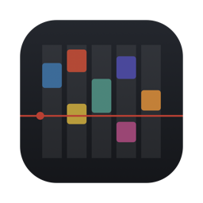
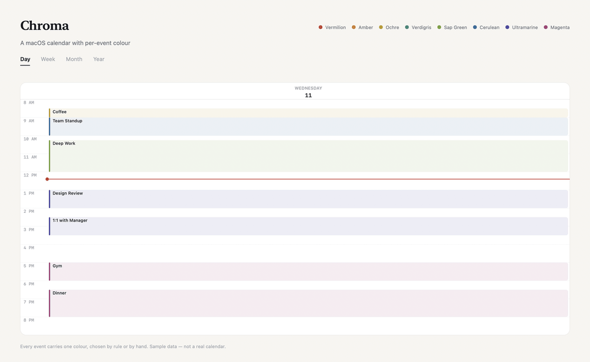

<p align="center">
  
</p>

# Chroma

A macOS calendar over EventKit, with the one feature Apple's own app refuses
to have: per-event colours. Day, week, month and year views. Builds with the
Swift compiler from the Command Line Tools — no Xcode project, no
dependencies.



*Sample data throughout — not a real calendar.*

## Build

```bash
./build.sh
```

Produces `build/Chroma.app`, renders the icon, writes `Info.plist`, and ad-hoc
signs the bundle. Install with:

```bash
cp -R build/Chroma.app /Applications/
```

The first launch asks for Calendar access. Because the bundle is ad-hoc signed,
macOS may ask again after a rebuild — the signature changes, so TCC reads it as
a different app.

## What it does

**One calendar.** It reads and writes a single calendar and ignores everything
else in the account — titled `Calendar` by default. Point it at a different
calendar (a synced Google account, say, whose EventKit title is usually that
account's email address) by setting `localCalendarTitle` in
`Sources/LocalConfig.swift`, which you create from `LocalConfig.swift.example`.
That file is git-ignored, so your real calendar name never ends up in source
control.

**Live in both directions.** There is no sync layer, because there is nothing to
sync: the app talks to the same EventKit database Calendar.app does. An event
added here shows up in Calendar.app and on iCloud; an event added there — or by
Claude, or arriving from another device — appears here the moment it lands. The
app listens for `EKEventStoreChanged` and reloads.

**Four views.** Day and week share one hour grid, with overlapping events packed
into columns the way Google Calendar does it and a live "now" line. Month is a
six-week grid that never changes height. Year is twelve mini months; click a day
to drop into it.

**Categories.** Every event belongs to one category, each with its own pigment,
matched by title. `Sources/Categories.swift` ships a small generic rule set
(`defaultCategories`) so the app is useful out of the box:

| Category | Pigment |
| --- | --- |
| Deadlines & assignments | Vermilion |
| Classes | Cerulean |
| Professor office hours | Sap Green |
| Office hours & advising | Verdigris |
| Professional meetings | Ultramarine |
| Club meetings | Amber |
| Campus events | Ochre |
| Social | Magenta |

Your own rules — real course numbers, professors, clubs, employers — belong in
`localCategories` in `Sources/LocalConfig.swift` instead of in
`Categories.swift`. When set, it overrides the default list entirely, and
because that file is git-ignored, none of it reaches source control. See
`LocalConfig.swift.example` for the shape.

Categorising happens on its own: the first reload after launch covers the whole
calendar, and every reload after that catches whatever just arrived — from
Claude, from Calendar.app, from another device. Events coloured by hand in the
inspector are never overwritten. **Organize › Assign Categories to Everything**
(`⇧⌘K`) re-runs the rules over the entire calendar and *does* overwrite hand
choices, which is the point of asking for it.

Claude assigns a category to anything it creates. It cannot reach the app's
colour store through AppleScript, so it writes a marker — `[chroma: club]` — on
the last line of the event's notes, and the app reads it. An explicit marker
beats the title rules, so it also travels with the event to your other devices.

**Search.** `⌘F`, or the field at the top of the sidebar. Matches are ranked by
how well they hit the title — exact, then prefix, then word-start, then
substring, then scattered subsequence — and within a tier what you can reach
soonest comes first: upcoming before past, soonest first among the upcoming.
Repeating events collapse to one row — the **next** occurrence, not the last. Clicking a result takes the view to that date
and opens it in the inspector.

**Clicking an event opens an inspector** on the right; double-clicking opens it
already in edit mode. Title, all-day, start, end, location and notes are all
editable in the pane, and colour applies the moment you pick it. There is no
modal sheet anywhere in the app — a sheet would cover the calendar, which is the
thing you want in view while moving an event's time.

**Per-event colours.** EventKit has no per-event colour, so these live in a
sidecar at `~/Library/Application Support/Chroma/colors.json`, keyed by the
event's identifier. Two consequences, neither avoidable:

- Colours are local to this Mac. They do not reach iCloud, your iPhone, or
  Calendar.app.
- A repeating event takes one colour for the whole series, since every
  occurrence shares an identifier.

Set one in the event editor, or right-click any event anywhere in the app.

**Repeats are editable.** Both the create pane and the inspector carry a repeat
control — frequency, interval, weekdays for weekly, and an end that is either a
date or a number of occurrences. Clearing it back to Never removes the repeat.

**Recurring events are expanded.** Every occurrence lands on its own date, which
is what the `.ics` export could not manage.

## Keyboard

| Shortcut | Does |
| --- | --- |
| `⌘1` `⌘2` `⌘3` `⌘4` | Day / Week / Month / Year |
| `⌘N` | New event on the selected day |
| `⌥Space` | Same, from any app — brings Chroma forward first |
| `⌃Space` | Ask Claude, from any app |
| `⌘F` | Search events |
| `⇧⌘K` | Organize › Assign Categories to Everything |
| `⇧⌘O` | Toggle TA & Advising Hours |
| `⌘T` | Today |
| `⌘←` / `⌘→` | Previous / next period |

The two `Space` combinations are system-wide. They use Carbon's
`RegisterEventHotKey` rather than an `NSEvent` monitor, so the app never asks for
Accessibility permission.

Modifier+Space keeps them one-handed and avoids taking a letter combination away
from every other app. Raycast holds `⇧⌘Space` and Spotlight `⌘Space`, so neither
of these collides. Note that `⌃Space` is also macOS's "previous input source"
switcher when more than one input source is installed.

## Ask Claude

`⌃Space`, or the sidebar button, opens a panel inside the app. Type a request in
plain language, press `⌘↩`, and the response streams back in place.

**Claude has no tools.** It never touches the calendar itself. The prompt carries
a numbered snapshot of your events — the year around the day in view, five months
back and seven ahead — and Claude replies with a sentence for you plus a JSON
plan:

```json
{"operations":[{"op":"create","title":"Office Hours",
  "start":"2026-09-08T15:00","end":"2026-09-08T16:00","category":"advising",
  "location":"Room 210",
  "recurrence":{"freq":"weekly","interval":1,"byDay":["TU"],"until":"2026-12-19"}}]}
```

Chroma applies that through EventKit and lists what changed. `update` and
`delete` refer to events by their number in the snapshot.

This replaced an earlier design where Claude drove Calendar.app over AppleScript.
That approach launched Calendar.app and left it in the Dock, made every date
locale-dependent, and could hang for minutes on an unbounded query. Handing back
a plan instead removes all three problems, and the tool allowlist along with them.

Repeating events can be changed one occurrence at a time — `"occurrences":
["2026-09-02","2026-09-09"]` on an update or delete affects only those dates.
Leave it off and the change applies to the whole series.

Repeating events appear once in the snapshot rather than as every occurrence.
Expanded, a term of one thrice-weekly lecture is forty-five lines on its own;
collapsed, the whole year fits in about a hundred and fifty. Nothing is lost,
since editing a repeating event applies to the series either way.

## Layout

| File | Holds |
| --- | --- |
| `Sources/EventStore.swift` | EventKit access, fetching, create/update/delete, search ranking |
| `Sources/Categories.swift` | The category rules and the colouring pass |
| `Sources/Recurrence.swift` | The repeat control shared by the create and edit panes |
| `Sources/ViewMode.swift` | The four zoom levels and their date maths |
| `Sources/Theme.swift` | Design tokens, the mode picker, the glyph button |
| `Sources/EventColors.swift` | The colour palette and its sidecar file |
| `Sources/EventChip.swift` | The pale-block-with-pigment-spine event treatment |
| `Sources/EventLayout.swift` | Column packing for overlapping events |
| `Sources/ContentView.swift` | Window chrome, sidebar, search, agenda |
| `Sources/DetailPane.swift` | The inspector, read and edit |
| `Sources/NewEventPane.swift` | The create form |
| `Sources/MonthView.swift` | Month grid |
| `Sources/TimeGridView.swift` | Day and week grids |
| `Sources/MiniMonth.swift` | Mini months and the year view |
| `Sources/ClaudePanel.swift` | The Claude popup and its CLI runner |
| `Sources/ClaudePlan.swift` | Parses Claude's reply and applies it through EventKit |
| `Sources/GlobalHotKey.swift` | Carbon system-wide shortcuts |
| `Sources/ChromaApp.swift` | Entry point, menus, hotkey registration |
| `Sources/LocalConfig.swift` | Your real calendar title and category rules — git-ignored |
| `tools/MakeIcon.swift` | Renders the app icon |
| `tools/RenderReadmeArt.swift` | Renders the images in this README from synthetic sample data |

## Known limits

- Editing a repeating event applies to this and all future occurrences; there is
  no "just this one".
- No drag to move or resize an event yet — use the editor.
- Colours are not backed up. Deleting `colors.json` resets every event to
  untagged.

## The design

**The chrome refuses colour so the content can own it.** Chroma exists because
per-event colour carries meaning; a tinted interface competes with the thing it
frames. Every structural element is ink or paper, and saturation is spent
entirely on events. One hue is reserved: the red now-line, because "you are
here" is the only other thing worth a colour.

The vocabulary is a printed course timetable — a serif for headings, a
monospace for the hour gutter and every date and time, hairline rules, and
events set as pale blocks with a solid pigment spine down one edge, the way a
swatch card shows its colour. The spine is deliberate: tinted fills wash out at
the sizes a month grid forces, but three saturated pixels hold their hue at any
size.

Pigments are named as pigments — Vermilion, Amber, Ochre, Verdigris, Sap Green,
Cerulean, Ultramarine, Magenta, Payne's Grey — because naming them properly is
most of what makes choosing one feel like a decision. Their stored ids are unchanged
from the first version, so renaming them orphaned nothing. Untagged events are a
neutral slate: if they were coloured, colour would stop meaning anything.

All tokens live in `Sources/Theme.swift`.
